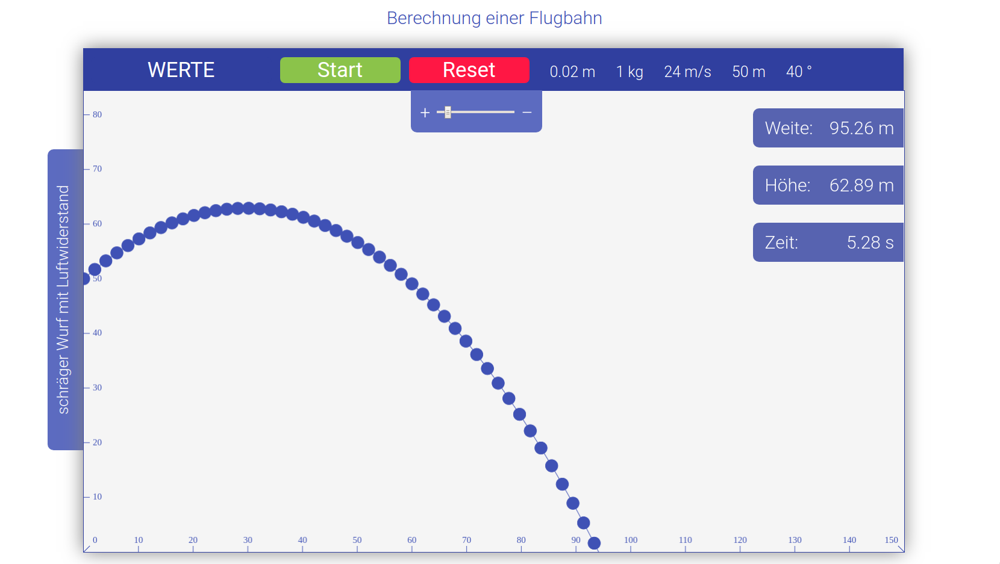

# Schräger Wurf Demo Web Site

Some HTML/JS Demo App from an old school project

## Installation

just clone the repository and open the `html` file in your favourite Web Browser. There are two versions available: one main version with nice material design oriented graphics and a simple version.

You can also try to find the easter egg ;-)
